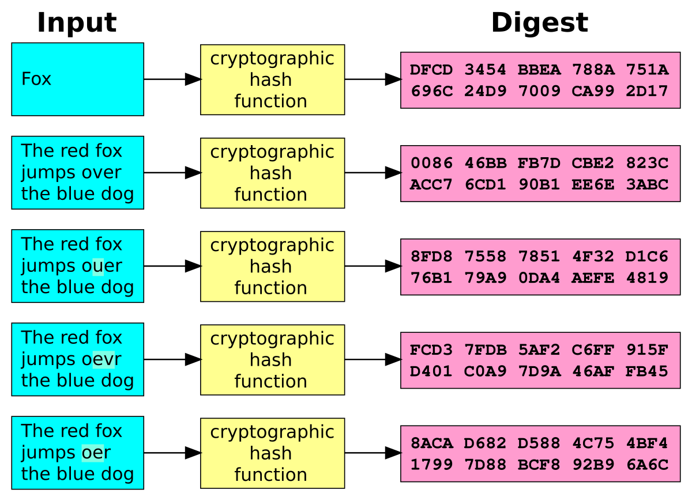

# Funções Hash

- Transforma um text de entrada(input) em um texto de saída(output) de tamanho fixo;
- O texto de entrada pode ter qualquer tamanho;
- O texto de saída sempre tem o mesmo tamanho.

Não importa o tamanho do texto o output sempre terá o mesmo tamanho.

## funções criptográficas

- Fácil de computar, ou seja, facil para transformar o texto em um hash isso para o computador.
- Livre de colisão: Impossível(só é muito, muito improvável de acontecer), dois inputs com o mesmo output.
- Unidirecional: Impossível* descobrir o input dado pelo seu hash.
- "Puzzle Friendly"