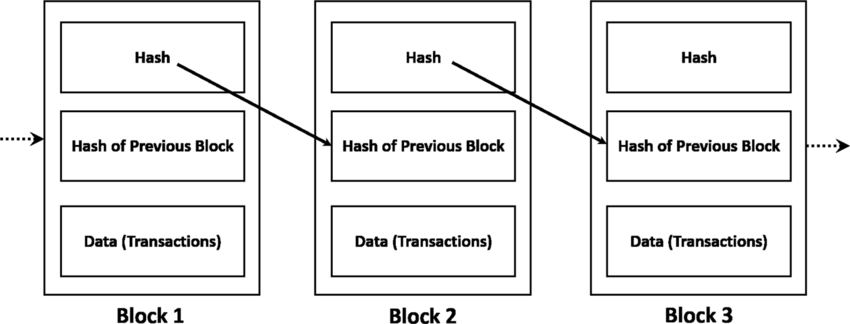
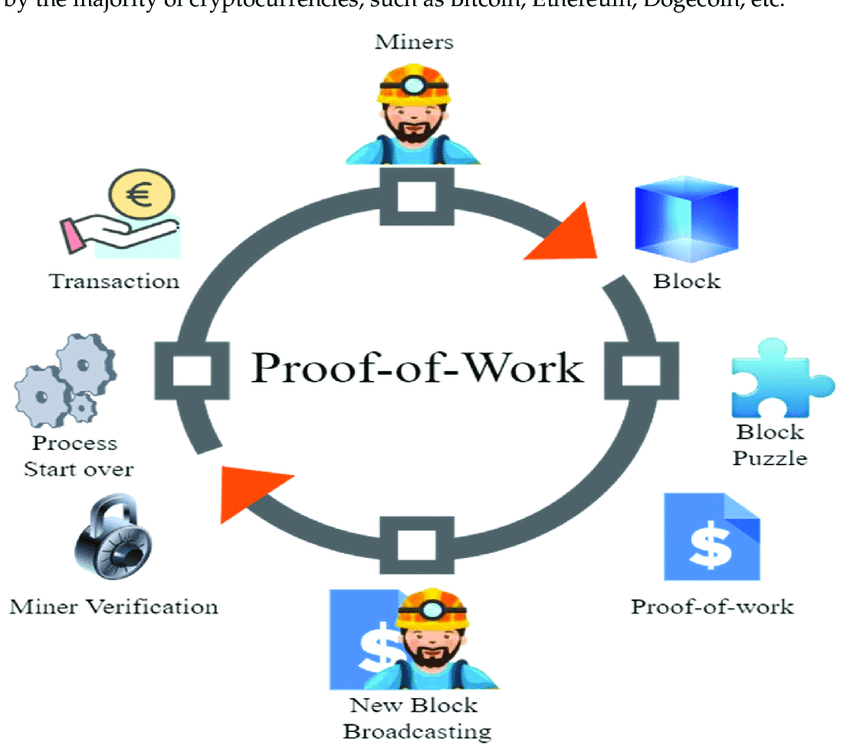

# Bitcoin Introdução

Criado por **Satoshi Nakamoto**, é apenas um pseudônimo.

É uma criptomoeda, não é só dinheiro. Dentro da própria lógica, já é um sistema de pagamentos; Em toda a história, apenas existirão 21 milhões de bitcoins em toda a história.

Em **2008**, foi lançado o artigo que definiu o bitcoin, tratando sobre:
- Criptografia
- Blockchain
- Redes descentralizadas
- "Engenharia de Incentivo" : Se seguir as regras do bitcoin, você ganha dinheiro, se não, você perde dinheiro.

**2009** -> Primeiro bloco do Bitcoin chamado de genesis block

**PORQUE DIABOS O BITCOIN É MUITO VALORIZADO?**

// TO DO: uma página sobre o **gasto duplo**
Ele foi a única criptomoeda a solucionar o problema de Gasto duplo


| Caracterísiticas         | Sistema Tradicional   | Bitcoin                   |
| ------------------------ | --------------------- | ------------------------- |
| **Contabilidade**        | Centralizada          | Blockchain                |
| **Armazenamento**        | Fracionado            | 100%                      |
| **Segurança**            | Institucional         | Criptográfica             |
| **Emissão de Moeda**     | Política Econômica    | Algoritmo                 |
| **Transações**           | Centralizado          | Distribuído, peer-to-peer |
| **Autenticação**         | centralizado          | Blockchain                |
| **Regulamentação**       | Banco Central, Normas | Ainda Indefinida          |
| **Processo de decisão**  | Arbitrário            | Consenso                  |
| **Controle do Dinheiro** | Banco                 | Você                      |
Se o não houver um consenso irá acontecer um "hard fork" no bitcoin. Serão criadas "novas" moedas baseadas na mesma premissa do bitcoin, porém com suas peculiaridades.

# Blockchain

É uma cadeia de blocos, lembra uma Linked List. Cada bloco tem dentro dele uma lista de dados e informações que apontam para o próximo bloco. Caso seja alterado algum dado dentro da blockchain, um dado, um letra, o que seja. A blockchain inteira dentro desse bloco é apagada, isso garante um grande nível de segurança. Tudo isso funciona graças as [Funções Hash](Funções%20Hash.md).

## Blockchain Básica

Por que a blockchain é inviolável?


Cada bloco possúi um Hash próprio, para ele ser gerado ele precisa do Hash do bloco anterior e os dados do bloco próprio bloco. A função é mais ou menos assim.

```bash
HASH do BLOCO: {Hash anterior || Dados}
```
_O que acontece se um hacker tentar alterar a blockchain do bitcoin?_

Se um hacker tentar inserir dados falsos na blockchain do Bitcoin, a integridade da cadeia de blocos será comprometida, tornando a fraude facilmente perceptível. Para que isso não aconteça, o hacker precisaria modificar praticamente toda a blockchain. Além de ser algo extremamente inviável, os demais participantes da rede rapidamente perceberiam que algo está errado, já que a nova cadeia que o hacker tentaria implementar seria completamente distinta da original. Em mais de dez anos de funcionamento, não há registros de adulterações bem-sucedidas na blockchain do Bitcoin.

Na tentativa de uma fraude, o atacante tera que inserir dados falsos, logo isso provocará uma mudança no **hash do bloco**, criando um **Hash diferente**. Se um bloco for alterado, seu hash será alterado, quebrando a cadeia de blocos 

> MODIFICAR DADOS = MUDA A CADEIA POR COMPLETO!

# Assinaturas Digitais

- Só você pode assinar
- Qualquer um pode verificar sua assinatura
- Assinatura atrelada ao documento

usa criptografia de chave pública

_O que acontece se alguém descobrir seu par chave pública/secreta?_

Se alguém descobrir seu par chave pública/secreta, esta pessoa poderá assinar qualquer documento como se fosse você. Sendo um conjunto de funções criptográficas, o sistema de assinatura digitais é incapaz de fazer distinção entre pessoas, apenas verificar a compatibilidade das chaves utilizadas. Proteger sua chave secreta é fundamental para segurança no Bitcoin.**principal meio de transferência do Bitcoin**

# Criando uma Moeda

## O que uma moeda faz?

- Quem tem quanto?
- **Quem transferiu quanto para quem?** esse é um dos principais problemas das moedas digitais.

Vamos nomear a nossa moeda de [CentralCoin](CentralCoin.md)

# O Bitcoin

Rede distribuida e Peer-to-Peer.

## A rede Bitcoin

- O "banco central" da CentralCoin é substituído por uma rede de computadores
- Distribuída
- Sem Hierarquia
- Protocolo de Consenso

> Na CentralCoin o banco decidia a ordem e validade das transações. No Bitcoin, todos os computadores da rede precisam entrar em acordo.
> > Mesmo que alguns computadores sejam maliciosos.

Para participar da rede do Bitcoin, basta você baixar um **client de bitcoin**, que é um conjunto de informações.

- Qualquer computador cone ctado à rede blockchain é um nó desta rede.
- __Full Nodes__(**MINERADORES**): 
    - Validam todas as transações emitidas pela rede.
    - mantêm a consistência da blockchain.

- __Lite Nodes__(**CARTEIRAS**):
    - Não armazenam toda a blockchain.
    - Necessitam de informação de outros nós.


### Mineradores
- Validam as transações recebidas e criam novos blocos
- Competem entre si pelo direito de adicionar o próximo bloco na blockchain
- Verificam blocos obtidos por outros mineradores e adicionam a blockchain quando válidos
- Sempre extendem o ramo mais longo da blockchain*

_O que acontece se um nó da rede começa a transmitir informações falsas?_

Nada. A rede Bitcoin é extremamente resistente a agentes maliciosos, porque todas as informações são verificadas antes de serem adicionadas na blockchain, e a partir daí tornam-se impossíveis de adulterar. Para adicionar informações falsas na blockchain, um hacker teria que ter ao menos 51% de todo o poder computacional da rede, algo extremamente improvável para o Bitcoin. Em criptomoedas pouco conhecidas e com poucos mineradores, este é um risco significativo. Outra possibilidade é o hacker roubar a chave secreta de um usuário, quando então poderá assumir a identidade (e os Bitcoins) da vítima, transferindo-os para onde quiser. Nesse caso, a falha de segurança não é na rede Bitcoin, já que as informações fornecidas são tecnicamente verdadeiras e a rede não é capaz de identificar quem as está transmitindo. Seria como se alguém tivesse roubado seu talão de cheques e soubesse imitar sua assinatura perfeitamente, sem a possibilidade de estornar os cheques utilizados.


# Proof of Work (PoW)

Bloco da blockchain tem um novo elemento: Hash do bloco, Hash do bloco anterior, **NONCE** e Transações
`Hash do bloco:{Hash anterior|| Transações || Nonce}`

>   O NONCE é um valor numérico sem significado que é adicionado a cada bloco da blockchain. Os mineradores alteram o valor do nonce tentando cumprir com o requisito do proof of work.

O minerador que conseguir encontrar o bloco com o hash que tenha um determinado numero de '0' no começo, isso é uma tentativa de adivinhar o hash do novo bloco. Esse número é chamado de **DIFICULDADE**. Um bloco novo é criado a cada 10 minutos.



Basicamente, após o minerador supostamente achar um bloco que condiz com a dificuldade, será avisado na rede do Bitcoin, através de uma **verificação implícita** do bloco os mineradores partem para minerar nesse novo bloco. _Lembrando, que isso é uma coisa aleatória podem ficar minerando no bloco antigo_

## Coinbase Transaction

Principal forma de remuneração dos mineradores. Ao criar um novo bloco após a mineração, o minerador ele vai poder criar transações de bitcoins novos(normalmente para a sua carteira). A quantidade de bitcoins que o minerador pode inserir dentro da coinbase transaction, é limitada e cai pela metade a quantidade de bitcoins a cada 4 anos. **TODO O DINHEIRO QUE EXISTE NO BITCOIN EXISTE POR CONTA DA TRANSACTION** 

> No começo do bitcoin, a cada coinbase transactions, era criado 50 BTCs, com o passar do tempo foi caindo pela metade.

_Já que a recompensa pela mineração vem caindo com o tempo, pode ser que no futuro haja bem menos mineradores. Qual é a consequência disso para a velocidade de criação de novos blocos?_

Nenhuma. Um novo bloco é criado, em média, a cada dez minutos. Se o número de mineradores é menor, fica mais fácil obter uma solução para o proof of work. Assim, a taxa de criação de blocos é mantida aproximadamente constante.